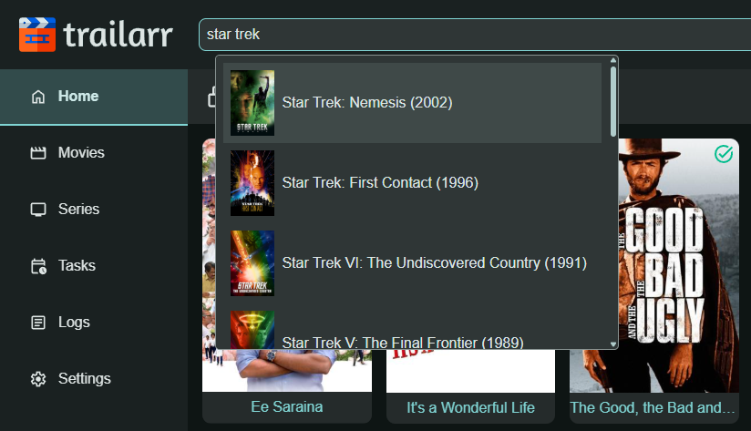

# General

This page explains some of the generic options that are available in the Trailarr UI

## Documentation Search

If you are looking for something, but not sure where to look in the documentation... Search is your friend! You can search with keywords.

## Search Media (`Ctrl + F`)

You can use the search bar at the top to search for any Media item in the Trailarr Library and open it to see it's details.

Search functionality is available on all pages. Search is not case-sensitive meaning `The Matrix` and `the matrix` will return same results!

You can also use Keyboard Shortcut `Ctrl + F` to trigger search. If you want to use browser search, press `Ctrl + F` again!

### Basic Search

Type at least 3 characters to trigger a search. Results match against the **title** and **clean title** of each media item.

### Bracket Filters

You can narrow results further by adding one or more filters in square brackets anywhere in the query. Each bracket is AND'd with the others and with the base text search.

**Syntax:** `<search term> [<filter>] [<filter>] ...`

Trailarr detects what to search based on the shape of the bracket value:

| Filter shape | Searches in | Match type |
|---|---|---|
| `[id=<number>]` (e.g. `[id=2]`) | Trailarr ID | Exact |
| Exactly 4 digits (e.g. `[2026]`) | Year | Exact |
| Anything else (e.g. `[english]`) | Language, IMDb ID, TMDB ID, TVDB ID, Studio, YouTube ID | Contains |

#### Examples

| Query | Results |
|---|---|
| `matrix` | Titles containing "matrix" |
| `matrix [1999]` | "Matrix" titles from 1999 |
| `[2024] [english]` | All English-language media from 2024 |
| `z [2026] [malayalam]` | Titles containing "z", year 2026, language Malayalam |
| `[tt0133093]` | Media with that IMDb ID |
| `[Warner]` | Media where studio contains "Warner" |

!!! tip
    If multiple connections are configured (e.g., Radarr + Plex), the same movie can appear more than once in results — each entry shows its connection name so you can tell them apart.

!!! note
    For more complex filtering (status, monitor state, custom criteria), use the **Custom Filters** feature on the Media page.
