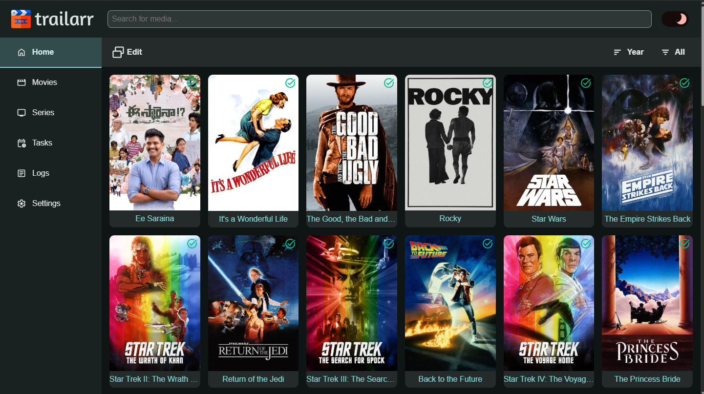
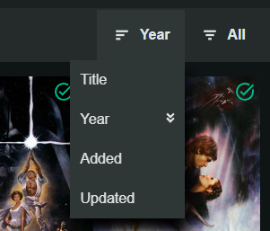
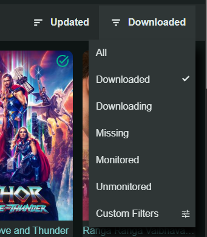
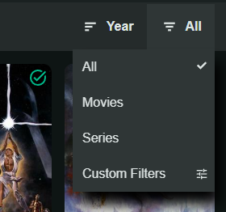
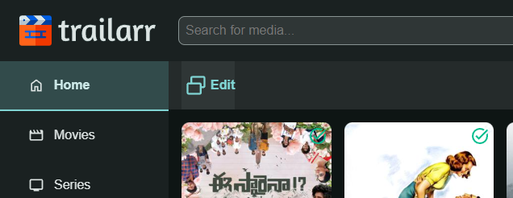
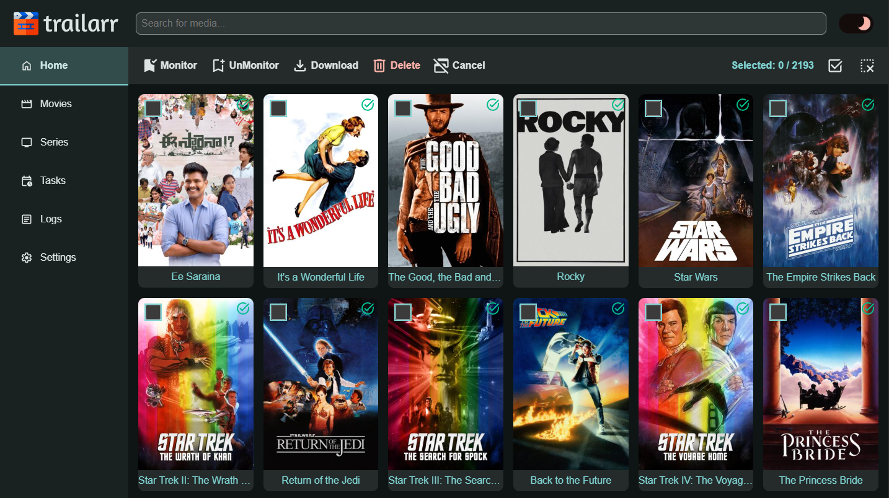
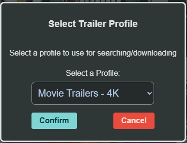

# Library

The Library section in Trailarr is your central hub for browsing and managing your media collection.

It's comprised of three main views:

- **Home**: Media items with downloaded trailers (URL: '/home')
- **Movies**: Movies from all Radarr Connections (URL: '/movies')
- **Series**: Series from all Sonarr Connections (URL: '/series')

!!! note "Scroll to display more items"
    Library displays 50 Media items at a time until it displays them all. More items will be displayed as you reach the end.

Library views offer some features for managing media items. They are described below:

## Media Details

Clicking on any Media item will open it's details page. See [Media Details](./media-details/index.md) for more info.

## Sorting

Media items in the view can be sorted using the following options:

- Title
- Year
- Added
- Updated

You can select the same sort option again to switch between Ascending and Descending!

## Filtering

Media items in the view can be filtered using the following options:

- All: No filter applied
- Downloaded: Has at least one downloaded video
- Downloading: Download currently in progress (live)
- Missing: No downloaded video (also includes monitored items)
- Monitored: Monitored for trailer download
- Unmonitored: No downloaded video and not monitored
- Unknown Profile: Media with downloads that have no profile assigned. {{ version_badge("add", "0.9.9") }}

!!! info "Status is computed live"
    {{ version_badge("upd", "0.10.2") }} Status is always derived from your actual downloads and the monitor flag: any active download → **Downloaded**, else monitored → **Monitored**, else **Missing**. It can never get stuck or drift out of sync with reality. **Downloading** is a live indicator of in-progress downloads (updated in real time) — it is not stored, so a crash or restart can never leave items showing *Downloading* forever.

!!! note "Downloads with no profile assigned"
    {{ version_badge("add", "0.9.9") }}
    When any downloads are not linked to a profile, the media pages show a banner ("N media items have downloads with no profile assigned") with a **Review** button, and the **Unknown Profile** quick filter appears in the filter dropdown. Open each media item and assign a profile from the Downloads section (see [Media Details](media-details/index.md#downloads-section)) — the banner and filter disappear automatically once every download has a profile.

!!! tip
    There is also an option to add a custom filter to fit your needs. These use the same mechanism as the `Filters` in `Profiles`, and view filters additionally get the [Download Filters](../settings/profiles/filters.md#download-filters-view-filters-only) family {{ version_badge("add", "0.11.3") }} — filter by download count, resolution, owning profile, download dates, or deleted files. The filter editor groups the fields into **Media**, **Downloads**, and **Files**. For more information see [Filters](../settings/profiles/filters.md).

The filters on the **Home** page are slightly different as it only contains media with downloaded items.

- All: No filter applied
- Movies: Movies only
- Series: Series only

Custom filters are also supported here!

!!! success ""
    When you make a selection for a `sort` or `filter` option, browser will remember and apply that next time.

## Edit View

Click on the `Edit` button in the top bar to enable edit view where you can perform some batch operations.

### Monitor

This will enable Monitoring of the selected Media items (no effect on items already monitored).

!!! info ""
    {{ version_badge("upd", "0.10.2") }} You can monitor anything — including media that already have a trailer. The download engine decides from per-profile download records, so monitored-and-satisfied media are simply left alone. Monitoring is changed only by you: connection syncs and downloads never touch it.

### UnMonitor

This will disable Monitoring of the selected Media items. 

However, this will have no effect on items:

- already unmonitored.

### Download

This can be used to batch download trailers. Selecting this will open up a dialog asking you to choose a Profile to use for downloading.

Make a selection and click 'Confirm' to start a background task to download all the trailers for selected Media items.

However, this will have no effect on items:

- with Non-Existing Media folder
- has a downloaded trailer
- media not yet downloaded (if `Wait for Media` is enabled)

### Delete

This will delete **ALL downloaded trailer files** for each selected Media item that has trailers.

Clicking Delete will show a confirmation dialog displaying the number of selected items before proceeding.

!!! warning
    This deletes **every** trailer file on disk for the selected items — not just one. This cannot be reversed!

### Cancel

Cancel the Batch Edit and go back to Normal View.

### Select All

Selects all items that are in the view based on selected filter before opening Edit View.

### Clear Selections

Clears all selections.