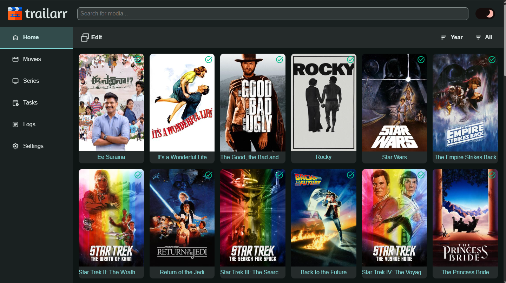
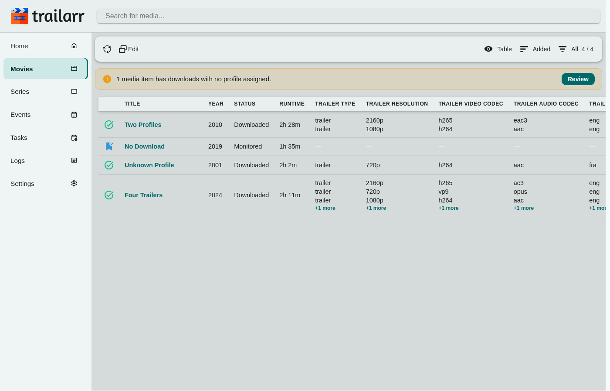
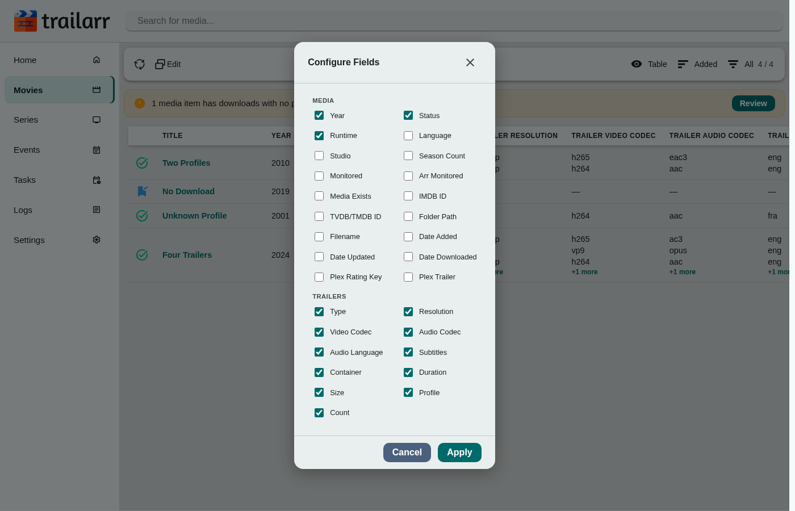
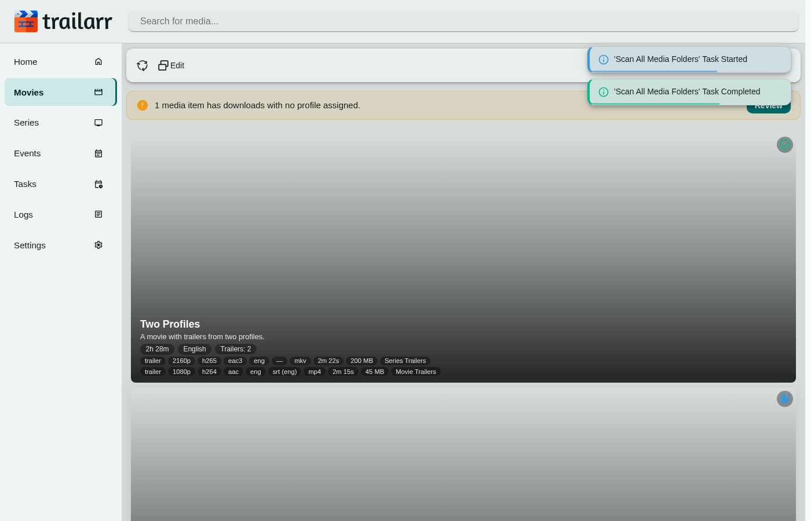
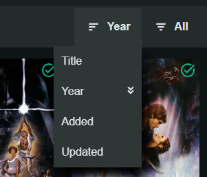
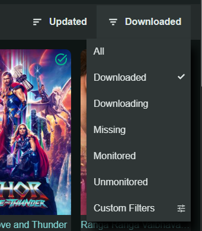
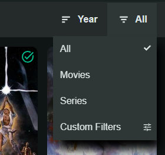
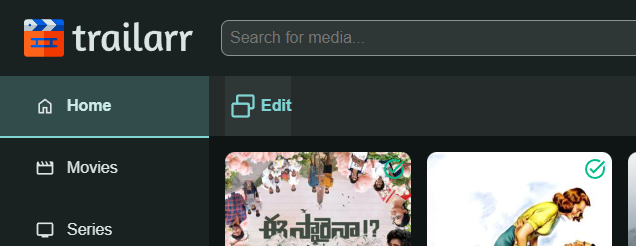
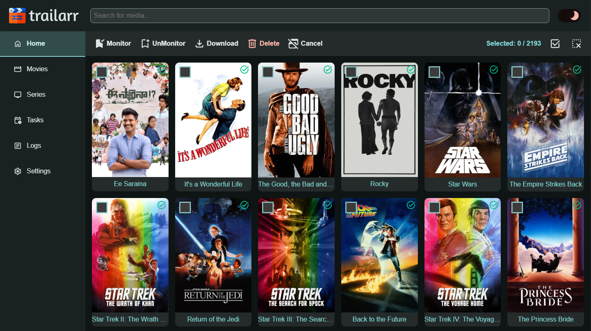
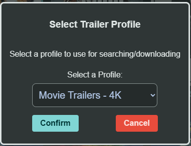

# Library

The Library section in Trailarr is your central hub for browsing and managing your media collection.

It's comprised of three main views:

- **Home**: Media items with downloaded trailers (URL: '/home')
- **Movies**: Movies from all Radarr Connections (URL: '/movies')
- **Series**: Series from all Sonarr Connections (URL: '/series')

!!! note "Scroll to display more items"
    Library displays 50 Media items at a time until it displays them all. More items will be displayed as you reach the end.

Library views offer some features for managing media items. They are described below:

## Media Details

Clicking on any Media item will open it's details page. See [Media Details](./media-details/index.md) for more info.

## Views

{{ version_badge("add", "0.14.0") }}

A library page shows its media items in one of three views. The view buttons are in the header of the page, and the choice is kept per browser.

- **Poster**: a grid of posters with the title and the year. This is the default.
- **Expanded**: a wide card per media item with a backdrop, the fields you choose as tags, and one row of tags per trailer.
- **Table**: one row per media item with a column per field, which scrolls sideways on a small screen.

The `Configure Fields` button next to the view buttons opens a dialog with the fields that the Expanded and Table views can show. The dialog has two groups:

- **Media**: the fields of the media item, such as the year, the studio, the language or the folder path.
- **Trailers**: the fields of the trailers of the media item: type, resolution, video codec, audio codec, audio language, subtitles, container, duration, size, the profile that owns the trailer, and the count of trailers.

A media item can have more than one trailer, one per profile, so the Trailers group shows one block per trailer. The Expanded view shows one row of tags per trailer below the tags of the media item, and the Table view stacks one line per trailer inside each trailer column, in the same order in every column, newest first. A media item with no trailer shows a dash. At most three trailers show per card or cell, then a `+N more` line that opens the media details page. The count field counts every trailer.

No trailer field shows until you turn it on. The field choice is kept per browser, in the same place as before `v0.14.0`, so a choice you made earlier stays.

## Sorting

Media items in the view can be sorted using the following options:

- Title
- Year
- Added
- Updated

You can select the same sort option again to switch between Ascending and Descending!

## Filtering

Media items in the view can be filtered using the following options:

- All: No filter applied
- Downloaded: Has at least one downloaded video
- Downloading: Download currently in progress (live)
- Missing: No downloaded video (also includes monitored items)
- Monitored: Monitored for trailer download
- Unmonitored: No downloaded video and not monitored
- Unknown Profile: Media with downloads that have no profile assigned. {{ version_badge("add", "0.9.9") }}
- Failing Downloads: Media with a trailer download that failed on two task runs or more. {{ version_badge("add", "0.13.1") }}

!!! info "Status is computed live"
    {{ version_badge("upd", "0.10.2") }} Status is always derived from your actual downloads and the monitor flag: any active download → **Downloaded**, else monitored → **Monitored**, else **Missing**. It can never get stuck or drift out of sync with reality. **Downloading** is a live indicator of in-progress downloads (updated in real time) — it is not stored, so a crash or restart can never leave items showing *Downloading* forever.

!!! note "Downloads with no profile assigned"
    {{ version_badge("add", "0.9.9") }}
    When any downloads are not linked to a profile, the media pages show a banner ("N media items have downloads with no profile assigned") with a **Review** button, and the **Unknown Profile** quick filter appears in the filter dropdown. Open each media item and assign a profile from the Downloads section (see [Media Details](media-details/index.md#downloads-section)) — the banner and filter disappear automatically once every download has a profile.

!!! note "Downloads that keep failing"
    {{ version_badge("add", "0.13.1") }}
    When a download fails on two task runs or more, the media pages show a banner ("N media items have a trailer download that keeps failing") with a **Review** button, and the **Failing Downloads** quick filter appears in the filter dropdown. Open an item: the [Download Profiles](media-details/index.md#download-profiles-section) section shows the reason of the last failure and, when Trailarr knows it, the fix. After you fix the cause, download the item again from its page, or select the items and use the batch **Download**: a manual download does not wait for the next retry. An item leaves the banner when a download succeeds, when you unmonitor it, or when no profile matches it any more.

!!! tip
    There is also an option to add a custom filter to fit your needs. These use the same mechanism as the `Filters` in `Profiles`, and view filters additionally get the [Download Filters](../settings/profiles/filters.md#download-filters-view-filters-only) family {{ version_badge("add", "0.11.3") }} — filter by download count, resolution, owning profile, download dates, or deleted files. The filter editor groups the fields into **Media**, **Downloads**, and **Files**. For more information see [Filters](../settings/profiles/filters.md).

The filters on the **Home** page are slightly different as it only contains media with downloaded items.

- All: No filter applied
- Movies: Movies only
- Series: Series only

Custom filters are also supported here!

!!! info "The filter button counts the view"
    {{ version_badge("add", "0.13.0") }}
    The filter button reads `2789 / 3746`. The first number is how many media items the filter matched. The second number is how many the page can show: every media item on the `Home` page, every movie on the `Movies` page, and every series on the `Series` page.

    On the `Home` page the count tells you how much of your library has a trailer, because that page shows only media with a downloaded video. On the `Movies` and `Series` pages, select `Downloaded` or `Missing` to get the same count for that type. A media item counts as done when it has at least one downloaded video, whatever the profile asked for. Custom filters get a count too.

!!! success ""
    When you make a selection for a `sort` or `filter` option, browser will remember and apply that next time.

## Edit View

Click on the `Edit` button in the top bar to enable edit view where you can perform some batch operations.

### Monitor

This will enable Monitoring of the selected Media items (no effect on items already monitored).

!!! info ""
    {{ version_badge("upd", "0.10.2") }} You can monitor anything — including media that already have a trailer. The download engine decides from per-profile download records, so monitored-and-satisfied media are simply left alone. Monitoring is changed only by you: connection syncs and downloads never touch it.

### UnMonitor

This will disable Monitoring of the selected Media items. 

However, this will have no effect on items:

- already unmonitored.

### Download

This can be used to batch download trailers. Selecting this will open up a dialog asking you to choose a Profile to use for downloading.

Make a selection and click 'Confirm' to start a background task to download all the trailers for selected Media items.

However, this will have no effect on items:

- with Non-Existing Media folder
- has a downloaded trailer
- media not yet downloaded (if `Wait for Media` is enabled)

### Delete

This will delete **ALL downloaded trailer files** for each selected Media item that has trailers.

Clicking Delete will show a confirmation dialog displaying the number of selected items before proceeding.

!!! warning
    This deletes **every** trailer file on disk for the selected items — not just one. This cannot be reversed!

!!! note "Trailers only"
    {{ version_badge("upd", "0.14.0") }} The action deletes the files of type `trailer` only. A featurette, a clip or another extra that a profile with another [Video Type](../settings/profiles/settings/general.md#video-type) downloaded stays. Delete such a file from the [Files section](./media-details/index.md#files-section) of the media details page.

### Cancel

Cancel the Batch Edit and go back to Normal View.

### Select All

Selects all items that are in the view based on selected filter before opening Edit View.

### Clear Selections

Clears all selections.