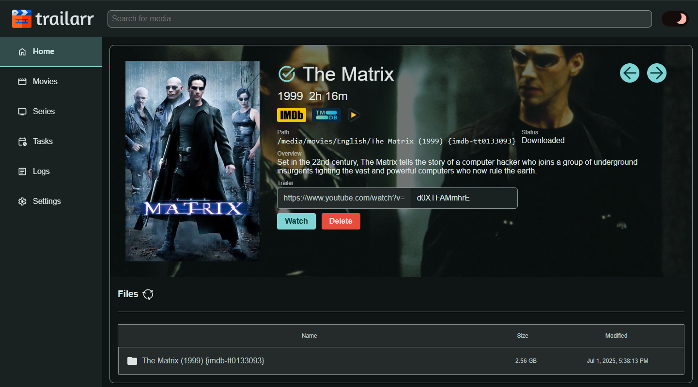
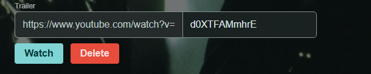
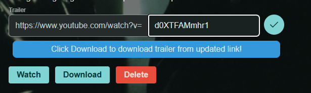
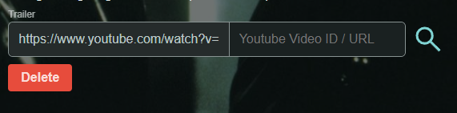
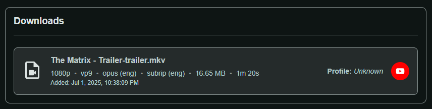
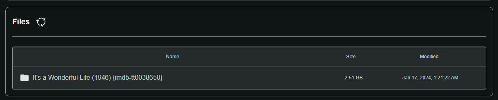
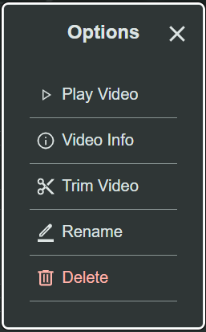

# Media Details

Media Details of an item will be opened in Trailarr UI under URL '/media/{id}' where `{id}` is the media ID in Trailarr.

Media Details view offers some features for managing media items. They are described below:

## Monitor / UnMonitor

<video autoplay loop src="./monitor-toggle.mp4" title="Media - Monitor Toggle"></video>

Media can be Monitored or UnMonitored by clicking the icon before the Media Title. Only monitored media is processed by the [Download Missing Trailers](../../tasks/index.md#download-missing-trailers) task.

!!! info ""
    {{ version_badge("upd", "0.10.2") }} Monitoring belongs to you alone: downloads no longer turn it off (since `v0.10.0`), and connection syncs never change it (since `v0.10.2`) — only you set it, plus the one-time starting value when media is first added ([Monitor New Media](../../settings/connections/index.md#monitor-types)). A monitored item whose matching profiles already have their downloads simply stays monitored without being re-downloaded — it is safe to keep everything monitored forever.

## Status - Additional Details

<video autoplay loop src="./media-status-additional-details.mp4" title="Media - Status - Additional Details"></video>

Additional Media Status details can be viewed by hovering (click on it in Mobile) on `Status` field.

!!! tip "Season Count for TV Show"
    This will also show a `Season Count` of the selected Media if it's a TV Show. This is coming from `Sonarr` and `Trailarr` can only read it, cannot update it!

### Plex Trailer Status

If a [Plex connection](../../../getting-started/03-setup/plex-connection.md) is configured and this media item has been linked to a Plex library entry, the details panel will show whether Plex already has a remote trailer available for it.

!!! info ""
    - The Plex trailer status is refreshed by the [Refresh Plex Trailer Flags](../../tasks/index.md#refresh-plex-trailer-flags) task, which runs weekly (first run within a few minutes of adding a Plex connection).
    - New media items that haven't been scanned yet will show no status until the next task run or until they are processed by `Download Missing Trailers`.

| Status | Meaning |
|--------|---------|
| ✅ Plex has trailer | Plex has at least one internet-sourced trailer for this item |
| ❌ No Plex trailer | Plex does not have a remote trailer (or the item is not linked to Plex) |

!!! tip ""
    This status is what Trailarr checks when **Skip if Plex Trailer** is enabled in a profile. If Plex already has a qualifying trailer, Trailarr will skip the download for that media item.

## YouTube Trailer ID

This is the YouTube video ID present in Trailarr for this Media item, and can be updated here!

This usually comes from `Radarr` for Movies, however `Sonarr` does not contain any such value so this will initially be empty for `TV Shows`.

### Save YouTube ID

A save button will appear if `YouTube Trailer ID` value has changed, prompting you to save.

!!! note ""
    Save will only save the `YouTube Trailer ID` in Trailarr, does not download trailer automatically!

### Search YouTube ID

A search button will appear if `YouTube Trailer ID` is not available for the `Media` in Trailarr.

This can be used to let Trailarr search for a trailer for the `Media` by selecting a `Profile`.

## Action Buttons

There are up to 2 action buttons that can appear depending on the selected Media.

### Watch 

- Appears when the selected Media has a YouTube Trailer ID set.
- Will open the video in YouTube in a new tab when clicked.

### Download

{{ version_badge("upd", "0.9.1") }}

- Always visible for all Media items.
- Clicking on this will open a dialog asking you to select a Profile to use for download.
- This will schedule a task for Trailarr to download a trailer for this Media, uses `YouTube Trailer ID` if provided/existing.

!!! tip "Multiple trailers"
    Because Trailarr supports downloading multiple trailers per media item (one per matching [Profile](../../settings/profiles/index.md)), the Download button is always shown so you can trigger additional downloads at any time.

    {{ version_badge("add", "0.10.0") }} A manual download always runs immediately — it bypasses the retry backoff that applies to automatic downloads after failures, and a successful manual download resets that backoff.

!!! tip ""
    To delete a trailer, use the **Files Section** below — click the trailer file and choose **Delete**.

## Download Profiles Section

{{ version_badge("add", "0.10.2") }}

This section shows, for **every** Trailer Profile, exactly where it stands with this media item:

- **Not matching** — the profile's filters do not apply to this item (or the profile is disabled).
- **Satisfied** — the profile already owns a downloaded video (its own download, or an existing file it claimed).
- **Pending** — the profile matches but has no download yet; it will download on the next task run.
- **Backing off** — previous download attempts failed; shows the attempt count, the last error, and when the next retry is due. A manual download bypasses the wait.

The matrix is computed with the exact same rule the download task uses, so what you see here is precisely what the engine will do next — there is no separate bookkeeping that could disagree with it.

## Downloads Section

This section shows the download history of the selected Media item.

It shows the following details:
- File Name
- Video Resolution
- Video Format
- Audio Format (and language if set)
- Subtitle Format (if any, and language if set)
- File Size
- Duration
- Downloaded At (date and time)
- Profile name used for download (clickable, opens the Profile details)
- Link to the YouTube video (clickable, opens in new tab)

!!! tip ""
    If the trailer was downloaded using an older version of Trailarr ( `< 0.6.0-beta`), some of the above details may not be available.

!!! tip ""
    - Profile name is shown as `Unknown` if the trailer was downloaded using an older version of Trailarr ( `< 0.6.0-beta`) or outside of Trailarr.
    - Profile name is shown as `Deleted` if the profile used for download has since been deleted.

!!! note "Assigning a profile to an `Unknown` download"
    {{ version_badge("add", "0.9.9") }}
    Trailarr automatically links `Unknown` downloads to a matching profile: a one-time **Attribute Trailer Downloads** task runs shortly after startup, and the files-scan task does the same for new trailer files it finds. It checks which profiles apply to the media item (by the profile's filters, ignoring state conditions like `trailer_exists`) and assigns them in priority order. If no profile could be matched automatically — either no profile's filters match the media, or all matching profiles already own a download for it — the `Unknown` label becomes a dropdown: click it and pick the profile that should own the download. The assignment is recorded as a [**Download Attributed**](../../events/index.md#download-attributed) event.

## Files Section

{{ version_badge("upd", "0.6.5") }}

The files and folders available in the media folder will be displayed here, starting with the Media folder itself!

Click on a folder to reveal it's files.

Clicking on the `Refresh` button will rescan the media folder for files and folders, updating the list accordingly.

!!! tip ""
    If you don't see your actual Media files here, that means you need to update either your [Volume Mappings](../../../getting-started/02-installation/docker-compose.md#media-folders) or [Path Mappings](../../../getting-started/03-setup/connections.md#2-path-mappings).

Clicking on a file will open a dialog with some actions available that can be performed on the file:

### Play Video

- Video files only!

Plays the selected video in a dialog. Click outside the dialog to close video!

### Video Info

- Video files only!

Reads and displays the details of the video file such as file, video, audio and subtitle formats along with language and some other relevant information.

### Trim Video

- Video files only!

Opens a dialog to trim the selected video file. You can set the start and end time to trim the video accordingly.

### View Text

- Text and some subtitle files only!

Displays the content of the text file!

### Rename

Renames the selected file with the given file name!

### Delete

Deletes the selected file upon confirmation.

!!! warning
    This will Delete the trailer file on disk! Cannot be reversed!

## Events Section

This section displays the Events related to the media item essentially like a history of what changes happened on this item.

See [Events](../../events/index.md) for more details on individual events.