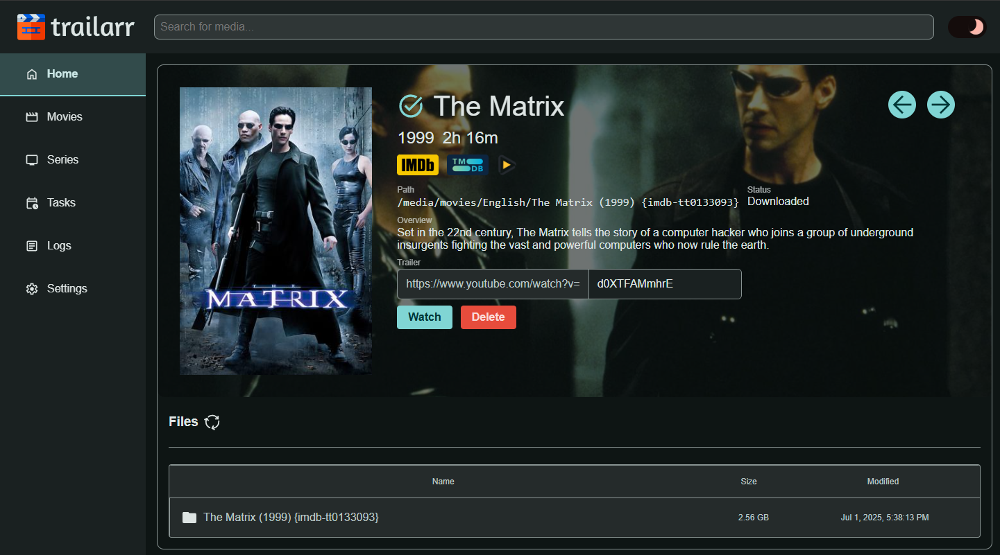
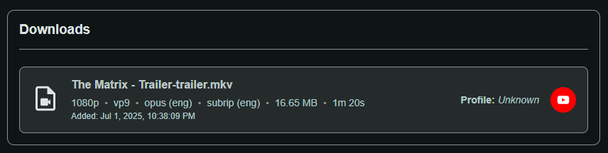
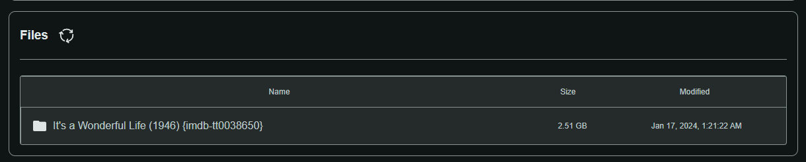
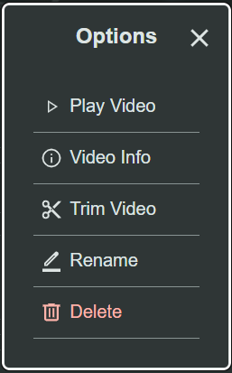

# Media Details

Media Details of an item will be opened in Trailarr UI under URL '/media/{id}' where `{id}` is the media ID in Trailarr.

Media Details view offers some features for managing media items. They are described below:

## Monitor / UnMonitor

<video autoplay loop src="./monitor-toggle.mp4" title="Media - Monitor Toggle"></video>

Media can be Monitored or UnMonitored by clicking the icon before the Media Title. Only monitored media is processed by the [Download Missing Trailers](../../tasks/index.md#download-missing-trailers) task.

!!! info ""
    {{ version_badge("upd", "0.10.2") }} Monitoring belongs to you alone: downloads no longer turn it off (since `v0.10.0`), and connection syncs never change it (since `v0.10.2`) — only you set it, plus the one-time starting value when media is first added ([Monitor New Media](../../settings/connections/index.md#monitor-types)). A monitored item whose matching profiles already have their downloads simply stays monitored without being re-downloaded — it is safe to keep everything monitored forever.

## Status - Additional Details

<video autoplay loop src="./media-status-additional-details.mp4" title="Media - Status - Additional Details"></video>

Additional Media Status details can be viewed by hovering (click on it in Mobile) on `Status` field.

!!! tip "Season Count for TV Show"
    This will also show a `Season Count` of the selected Media if it's a TV Show. This is coming from `Sonarr` and `Trailarr` can only read it, cannot update it!

### Plex Trailer Status

If a [Plex connection](../../../getting-started/03-setup/plex-connection.md) is configured and this media item has been linked to a Plex library entry, the details panel will show whether Plex already has a remote trailer available for it.

!!! info ""
    - The Plex trailer status is refreshed by the [Refresh Plex Trailer Flags](../../tasks/index.md#refresh-plex-trailer-flags) task, which runs weekly (first run within a few minutes of adding a Plex connection).
    - New media items that haven't been scanned yet will show no status until the next task run or until they are processed by `Download Missing Trailers`.

| Status | Meaning |
|--------|---------|
| ✅ Plex has trailer | Plex has at least one internet-sourced trailer for this item |
| ❌ No Plex trailer | Plex does not have a remote trailer (or the item is not linked to Plex) |

!!! tip ""
    This status is what Trailarr checks when **Skip if Plex Trailer** is enabled in a profile. If Plex already has a qualifying trailer, Trailarr will skip the download for that media item.

## Add a video

{{ version_badge("upd", "0.14.0") }}

The `YouTube Trailer ID` box of earlier versions is gone. Add a video to the [Known videos](#known-videos) list instead: paste a YouTube link or id, choose its language and its type, and click `Add`. The video goes to the top of the list, Trailarr tries it before every other source, and no task removes it.

!!! note ""
    Adding a video only stores it in Trailarr. It does not download it. Click `Download` on the row to get it now, or wait for the `Download Missing Trailers` task.

The **type** says what the video is: a trailer, a teaser, a clip, a featurette, a behind-the-scenes video, bloopers or other. A profile uses the videos of its own [Video Type](../../settings/profiles/settings/general.md#video-type) only, so a featurette you add is for your featurette profile and never becomes the trailer.

### Search

The `Search` button lets Trailarr search YouTube for a trailer with a `Profile` that you select. The result is added to the list as a search result. Only a trailer profile can search: a profile of another type takes its videos from TMDB, and the button refuses it.

## Known videos

{{ version_badge("add", "0.13.0") }}

Every video that Trailarr can download for this media item, grouped by type, with the trailers first. Inside a type, the list is in the order Trailarr tries them:

| Label | Where it came from |
|---|---|
| **You chose this** | You pasted the link. It wins over every other source, and no task removes it. |
| **TMDB** | A video from the list that TMDB curates, of any type. Needs a [TMDB API key](../../settings/tmdb.md). |
| **Radarr / Sonarr** | The id that your Arr reports for this item. |
| **YouTube search** | What a search found on an earlier run, kept so the next run does not search again. |

Trailarr takes the first video that works. When a download fails, that video moves to the end of the list for the next run, so a video that YouTube no longer has does not block the ones behind it.

Click the title to watch a video on YouTube. Click the cross to remove one. A video you chose comes back only when you add it again; a video from TMDB comes back with the next refresh.

{{ version_badge("add", "0.14.0") }} Each row shows the **type** of the video, and a `Download` button. The button downloads that video now with a profile that you pick from the profiles of the same type, so a featurette row offers your featurette profiles. Until `v0.14.0` the list held trailers only; the update marks every list as stale, and the other types arrive with the next `Refresh Video Lists` run.

{{ version_badge("add", "0.13.0") }} The **Language** box next to the YouTube ID records which language your video is in. A profile that asks for that language can then use it, which is how one media item serves an Italian profile and an English one — see [Trailer Language](../../settings/profiles/settings/general.md#trailer-language). Leave it empty if the video suits a profile that takes any language.

## Action Buttons

There are up to 2 action buttons that can appear depending on the selected Media.

### Watch

- {{ version_badge("upd", "0.14.0") }} Appears when the [Known videos](#known-videos) list has at least one video.
- Opens the first video of the list, the one a download would take, in YouTube in a new tab.

### Download

{{ version_badge("upd", "0.9.1") }}

- Always visible for all Media items.
- Clicking on this will open a dialog asking you to select a Profile to use for download.
- This will schedule a task for Trailarr to download a trailer for this Media, with the first [known video](#known-videos) that the profile can use.

!!! tip "Multiple trailers"
    Because Trailarr supports downloading multiple trailers per media item (one per matching [Profile](../../settings/profiles/index.md)), the Download button is always shown so you can trigger additional downloads at any time.

    {{ version_badge("add", "0.10.0") }} A manual download always runs immediately — it bypasses the retry backoff that applies to automatic downloads after failures, and a successful manual download resets that backoff.

!!! tip ""
    To delete a trailer, use the **Files Section** below — click the trailer file and choose **Delete**.

## Download Profiles Section

{{ version_badge("add", "0.10.2") }}

This section shows, for **every** Trailer Profile, exactly where it stands with this media item:

- **Not matching** — the profile's filters do not apply to this item (or the profile is disabled).
- **Satisfied** — the profile already owns a downloaded video (its own download, or an existing file it claimed). {{ version_badge("upd", "0.13.1") }} With [Upgrade To TMDB Trailer](../../settings/profiles/settings/general.md#upgrade-to-tmdb-trailer) on, the row also says whether the download is a TMDB trailer, or why the upgrade keeps it: the item has no TMDB id, TMDB was not asked yet, TMDB lists nothing in the language of the profile, or the video of the trailer is unknown.
- **Pending** — the profile matches but has no download yet; it will download on the next task run. With the upgrade on, the row says that the download replaces the trailer, and why. {{ version_badge("upd", "0.14.0") }} A profile of a [Video Type](../../settings/profiles/settings/general.md#video-type) other than `Trailer` stays pending while TMDB lists no video of its type for the item, and the row says that it waits for TMDB; such a profile never searches YouTube.
- **Backing off** — previous download attempts failed; shows the attempt count, when the next retry is due, and {{ version_badge("upd", "0.13.1") }} the reason of the last failure with the fix, when Trailarr knows it. A manual download bypasses the wait.

The matrix is computed with the exact same rule the download task uses, so what you see here is precisely what the engine will do next — there is no separate bookkeeping that could disagree with it.

## Downloads Section

This section shows the download history of the selected Media item.

It shows the following details:
- File Name
- Video Resolution
- Video Format
- Audio Format (and language if set)
- Subtitle Format (if any, and language if set)
- File Size
- Duration
- Downloaded At (date and time)
- Profile name used for download (clickable, opens the Profile details)
- Link to the YouTube video (clickable, opens in new tab)
- {{ version_badge("add", "0.14.0") }} The type of the video: trailer, teaser, clip, featurette, behind the scenes, bloopers or other. A download takes the type of its profile. A file that Trailarr found on disk takes the type that its name and folder say, following the names that Plex and Jellyfin use (`-featurette`, `Featurettes/`, ...).

!!! tip ""
    If the trailer was downloaded using an older version of Trailarr ( `< 0.6.0-beta`), some of the above details may not be available.

!!! tip ""
    - Profile name is shown as `Unknown` if the trailer was downloaded using an older version of Trailarr ( `< 0.6.0-beta`) or outside of Trailarr.
    - Profile name is shown as `Deleted` if the profile used for download has since been deleted.

!!! note "Assigning a profile to an `Unknown` download"
    {{ version_badge("add", "0.9.9") }}
    Trailarr automatically links `Unknown` downloads to a matching profile: a one-time **Attribute Trailer Downloads** task runs shortly after startup, and the files-scan task does the same for new trailer files it finds. It checks which profiles apply to the media item (by the profile's filters, ignoring state conditions like `has_downloads`) and assigns them in priority order. If no profile could be matched automatically — either no profile's filters match the media, or all matching profiles already own a download for it — the `Unknown` label becomes a dropdown: click it and pick the profile that should own the download. The assignment is recorded as a [**Download Attributed**](../../events/index.md#download-attributed) event.

    {{ version_badge("upd", "0.14.0") }} A profile takes a file of its own type only: a featurette found on disk is never given to a trailer profile, and it stays `Unknown` until a featurette profile matches the item, or until you assign it. When you assign a file to a profile by hand, the file takes the type of that profile, because you say what the file is.

## Files Section

{{ version_badge("upd", "0.6.5") }}

The files and folders available in the media folder will be displayed here, starting with the Media folder itself!

Click on a folder to reveal it's files.

Clicking on the `Refresh` button will rescan the media folder for files and folders, updating the list accordingly.

!!! tip ""
    If you don't see your actual Media files here, that means you need to update either your [Volume Mappings](../../../getting-started/02-installation/docker-compose.md#media-folders) or [Path Mappings](../../../getting-started/03-setup/connections.md#2-path-mappings).

Clicking on a file will open a dialog with some actions available that can be performed on the file:

### Play Video

- Video files only!

Plays the selected video in a dialog. Click outside the dialog to close video!

### Video Info

- Video files only!

Reads and displays the details of the video file such as file, video, audio and subtitle formats along with language and some other relevant information.

### Trim Video

- Video files only!

Opens a dialog to trim the selected video file. You can set the start and end time to trim the video accordingly.

### View Text

- Text and some subtitle files only!

Displays the content of the text file!

### Rename

Renames the selected file with the given file name!

### Delete

Deletes the selected file upon confirmation.

!!! warning
    This will Delete the trailer file on disk! Cannot be reversed!

## Events Section

This section displays the Events related to the media item essentially like a history of what changes happened on this item.

See [Events](../../events/index.md) for more details on individual events.